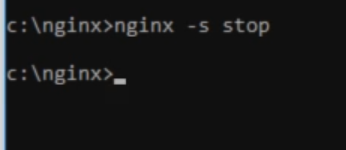
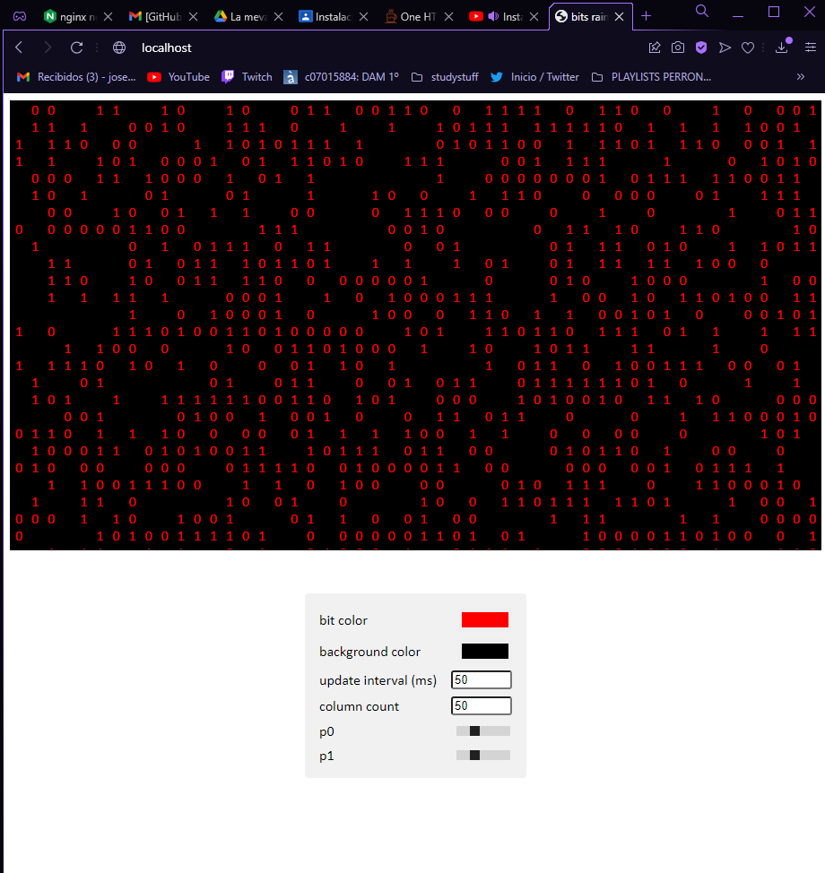

# Practica-NGINX
Practica sobre instalación y uso de NGINX desde WINDOWS

CORTAVARRIA ANDARA ,José Noel

1º DAM

Como hemos visto en clase, Nginx es un servidor web ligero y eficiente , pero,

Como funciona NGINX ?

Nginx esta construido de manera que ofrezca un bajo uso de memoria  y alta concurrencia , en vez de crear nuevos procesos para cada petición de pagina web, por ello decimos que Nginx es ‘ligero’.

Algunas de las características más comunes de Nginx incluyen:

*   Reverse proxy with caching.( consiste en proteger al usuario de ser expuesto por internet)
*   IPv6
*   Balanceamiento de las carga
*   WebSockets

Entre muchas otras.

En la siguiente práctica aprenderemos  tanto su instalación como  la configuración de dos virtualhost , con los que accederemos a diferentes subdominios , en nuestro caso elegiremos dos proyectos de  la siguiente página web [pagina](https://www.google.com/url?q=https://onehtmlpagechallenge.com/&sa=D&source=editors&ust=1651838895360685&usg=AOvVaw1A2THk-JzFTEobeloO3gpN).

En nuestro caso hemos elegido los siguientes dos proyectos:

Yo he escogido ‘bits-rain’ y ‘birthday-cake’

PARA EMPEZAR..

Lo primero es la instalación de NGINX, al ser un software más orientado para Linux , en Windows tendremos que realizarlo de otra manera pero no difiere demasiado.

La página de instalación 

La versión que instalaremos 

Procedemos a su descarga e instalación. Llegados a este punto creo que no hace falta explicar como

USO DE NGINX

Ejecutaremos NGINX, y no es una aplicación común , le daremos al ejecutable y no se abrirá nada .Pero no hemos hecho nada mal, NGINX se ejecuta y para comprobar si funciona puedes hacerlo de las siguientes formas .

O bien con el administrador de tareas 

o escribiendo en el navegador ‘localhost’

En caso de querer detener el funcionamiento de NGINX , o bien directamente desde el Administrador de tareas o usando el comando en la consola nginx -s stop

Algunas opciones de nginx

Para poder manipular NGINX en Windows tenemos que acceder a ‘Activar/Desactivar características de windows y habilitar la consola que nos permitira manipular webs remotas/locales etc..

Seguido esto abrimos la consola de administración de IIS que acabamos de instalar

Escogemos la ruta que queremos (física ) del archivo , y abrimos el nginx.conf donde modificaremos la ruta ‘root’ a la ruta que hemos especificado previamente

Al finalizar esto, podemos usar NGINX y el proyecto HTML que queramos desde LOCALHOST

EJECUCIÓN DE Bits-rain :

EJECUCIÓN DE Birthday-Cake:

